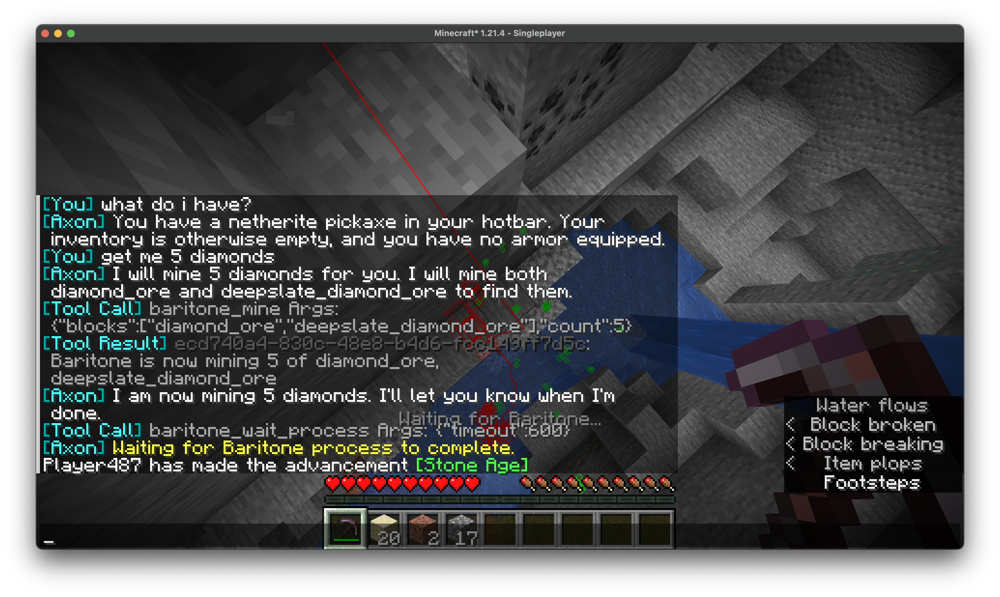

# Axon

[](https://github.com/jeremy46231/axon/actions/workflows/build.yml)  

Axon is an autonomous agent for Minecraft, combining a Large Language Model with the tools and context to control Baritone within a feedback loop. Give it commands in plain English, and watch it automate everything from mining resources to executing complex, multi-step plans.



Axon integrates:

- [Gemini](https://deepmind.google/models/gemini) for high-level planning and natural language control
  - Standard agent (tools-in-a-loop) setup with access to a chat with the user, a variety of contextual information, and a number of functions to call
- [Baritone](https://github.com/cabaletta/baritone) for intelligent pathfinding (navigation, waypoints, mining, farming, and more)
  - Manages Baritone's state and gives the LLM access to current status and functions
- [Meteor Client](https://github.com/MeteorDevelopment/meteor-client) for player management (managing tools, food, armor, items, etc., defending against mobs, and more)
  - Automatically configures a variety of modules to help the bot take care of itself

## Setup

Requirements:

- Minecraft 1.21.4
- [Fabric Loader](https://fabricmc.net/use/installer/)

Put these mods in your `.minecraft/mods/` folder:

- [Axon](https://github.com/jeremy46231/axon/releases/download/nightly/axon-1.0.0.jar)
- [Baritone](https://github.com/jeremy46231/axon/raw/refs/heads/main/libs/baritone-api-fabric-1.11.1-2-ga0f100f4.jar)
- [Meteor Client](https://meteorclient.com/api/download?version=1.21.5)

Get your free Gemini API key (no payment method needed, just a Google account):

1.  Go to [Google AI Studio](https://aistudio.google.com/apikey)
2.  Click "Create API key" and follow the steps
3.  Copy the generated API key
4.  In Minecraft, run `/a-key <your_api_key>`

You're all set! Axon is now ready for your commands.

## Usage

Use the `/a` command followed by your request in natural language.

```
/a <your request here>
```

If the agent ever gets stuck or confused, you can reset its memory and stop all actions with:

```
/a-clear
```

### Examples

Here are a few things you can ask Axon to do:

- **Navigation**

  - `/a go to 120 -450`
  - `/a go to the surface`
  - `/a remember that this is home`

- **Mining & Gathering**

  - `/a mine 50 iron ore`
  - `/a get 64 logs, then go back to where you started`
  - `/a go to Y level -54 and mine diamonds`

- **Interaction & Inventory**

  - `/a follow the player named Steve`
  - `/a drop the diamonds you collected`
  - `/a put all your weapons in the hotbar`

- **Information**
  - `/a what's in my inventory?`
  - `/a what are my coordinates?`
  - `/a tell me about what's going on`

### How it works

Here's the basic flow:

1.  You type a command like `/a get a stack of wood`
2.  The agent packages your command, the past conversation history, and real-time game data (your exact position, health, hunger, current biome, time of day, a complete list of your inventory)
3.  This information is sent to the Gemini LLM, which processes it and returns a response containing text and/or function calls.
4.  The agent receives the function call from the AI and executes it (like "call the `baritone_mine` function for `oak_log`")
5.  The result of the action(s) are sent back to the LLM in a loop until it stops returning function calls, allowing Gemini to execute a multi-step plan sequentially or adapt to changes in the environment
